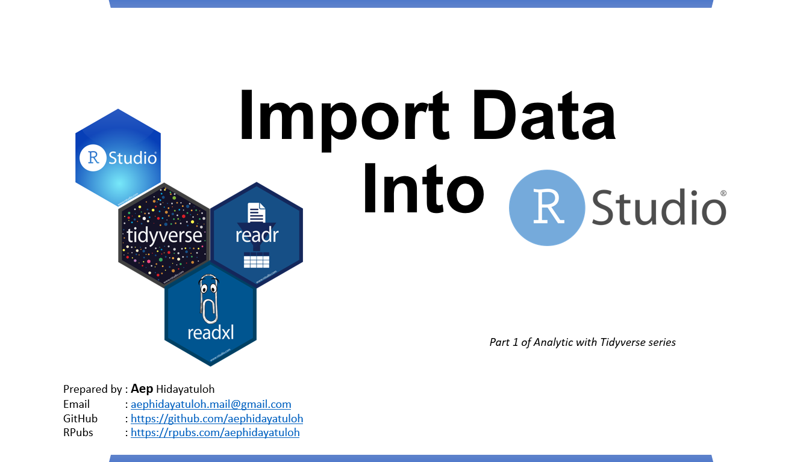

<style type="text/css">

body{ /* Normal  */
      font-size: 14px;
  }
td {  /* Table  */
  font-size: 12px;
}
h1.title {
  font-size: 38px;
  color: lightblue;
  font-weight: bold;
}
h1 { /* Header 1 */
  font-size: 24px;
  color: DarkBlue;
}
h2 { /* Header 2 */
  font-size: 20px;
  color: DarkBlue;
}
h3 { /* Header 3 */
  font-size: 16px;
#  font-family: "Times New Roman", Times, serif;
  color: DarkBlue;
}
h4 { /* Header 4 */
  font-size: 14px;
  color: DarkBlue;
}
code.r{ /* Code block */
    font-size: 12px;
}
pre { /* Code block - determines code spacing between lines */
    font-size: 12px;
}
rstudio {/* RStudio block */
    float: left;
}
</style>


```{r setup, include=FALSE}
#knitr::opts_chunk$set(echo = TRUE)
knitr::opts_chunk$set(echo = TRUE, fig.width = 6.5, results = 'hold', warning = FALSE, fig.show = 'hold', message = FALSE) 
options(scipen = 99)
``` 

<p align="center">

<br/>
<h4 style="text-align:center;">By Aep Hidayatuloh</h4>
<h4 style="text-align:center;">Last Update: 15 December 2019</h4>
</p>


# Introduction


<div> is one of most used Integrated Development Environment (IDE) for R that makes it easy to build R script in more interactive mode.<br/>
i.e. auto-complete code, organized panel and many more useful functional.</div>

<strong style="color:#3489eb;">RStudio</strong> is available in two formats: 

* <strong style="color:#3489eb;">RStudio</strong> Desktop -> program is run locally as a regular desktop application;
* <strong style="color:#3489eb;">RStudio</strong> Server -> allows accessing RStudio using a web browser while it is running on a remote Linux server.

<strong style="color:#3489eb;">RStudio</strong> Desktop and <strong style="color:#3489eb;">RStudio</strong> Server are both available in free and fee-based (commercial) editions. 

Download latest version of <strong style="color:#3489eb;">RStudio</strong> [https://www.rstudio.com/products/rstudio/download/] 

<div class="row">
  
</div>

# Use R`s Built-in Data

Setelah berhasil menginstall R di komputer, secara otomatis R juga menyediakan data yang dapat digunakan. Biasanya data ini digunakan untuk perkenalan dan latihan.

## The iris and mpg dataframe


